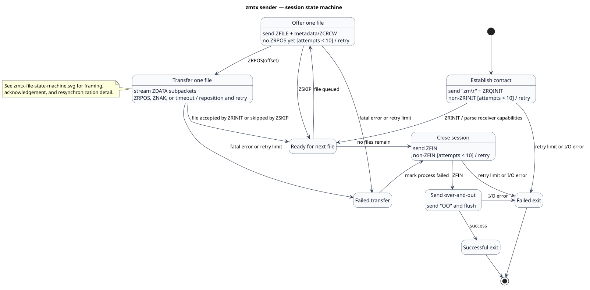
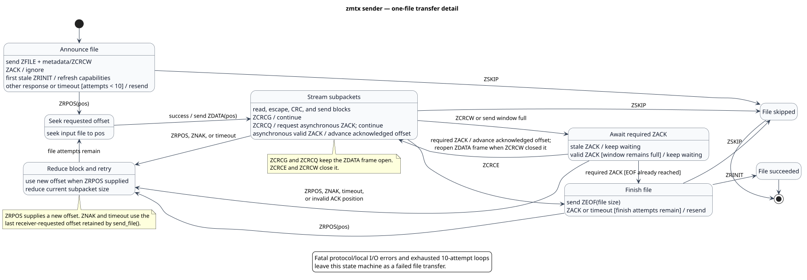
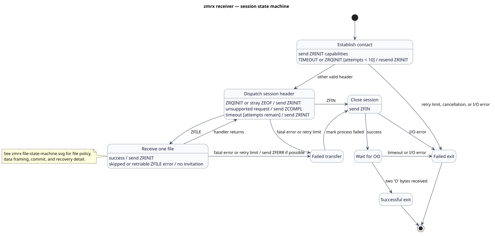
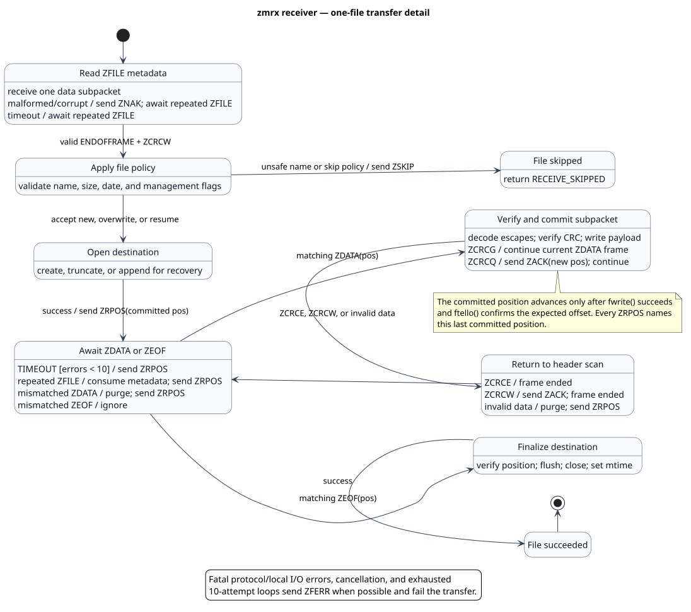

# Implemented ZMODEM state machines

These UML state machines document the behavior implemented by `zmtx`, `zmrx`,
and the shared framing routines. They describe this codebase rather than every
optional operation in the full ZMODEM specification.

## Sender

### Session



PlantUML source: [zmtx-state-machine.puml](zmtx-state-machine.puml)

### One-file transfer



PlantUML source:
[zmtx-file-state-machine.puml](zmtx-file-state-machine.puml)

The sender follows the control flow in
[`send_file()`](../zmtx.c#L580), [`send_from()`](../zmtx.c#L334), and
[`main()`](../zmtx.c#L917). It negotiates receiver capabilities, announces each
file, streams data from the receiver-requested position, recovers through
`ZRPOS`, and closes with the `ZFIN`/`ZFIN`/`OO` exchange.

## Receiver

### Session



PlantUML source: [zmrx-state-machine.puml](zmrx-state-machine.puml)

### One-file transfer



PlantUML source:
[zmrx-file-state-machine.puml](zmrx-file-state-machine.puml)

The receiver follows the control flow in
[`receive_file()`](../zmrx.c#L446),
[`receive_file_data()`](../zmrx.c#L214), and
[`main()`](../zmrx.c#L871). Its durable recovery point is the local file offset
after a successful write. It requests that offset with `ZRPOS` whenever a
header, position, or data subpacket cannot be accepted.

## Peer-visible transitions

| Phase | Sender to receiver | Receiver to sender |
| --- | --- | --- |
| Contact | `ZRQINIT` | `ZRINIT` with capabilities and optional buffer size |
| File offer | `ZFILE` + metadata ending in `ZCRCW` | `ZRPOS(offset)`, `ZSKIP`, or `ZNAK` |
| Data | `ZDATA(offset)` + one or more data subpackets | Optional `ZACK(offset)` or recovery `ZRPOS(offset)` |
| File completion | `ZEOF(size)` | `ZRINIT` when the exact ending offset was committed |
| Session completion | `ZFIN`, then `OO` | `ZFIN` |

The data-subpacket terminator controls the nested streaming state:

| Terminator | ZDATA frame | Receiver response | Implemented use |
| --- | --- | --- | --- |
| `ZCRCG` | Remains open | None on success | Normal streaming |
| `ZCRCQ` | Remains open | `ZACK(position)` | Asynchronous window progress |
| `ZCRCE` | Closes | None on success | Final subpacket before `ZEOF` |
| `ZCRCW` | Closes | `ZACK(position)` | Stop-and-wait or receiver-buffer boundary |

## Shared framing behavior

The shared decoder in [`zmdm.c`](../zmdm.c) supplies the events used by both
state machines:

- `rx_header()` scans for `ZPAD [ZPAD] ZDLE`, accepts fixed `ZBIN`, `ZHEX`, and
  `ZBIN32` headers, verifies their CRC, and returns the frame type.
- `rx_data()` decodes escaped bytes and returns `FRAMEOK` for `ZCRCG`/`ZCRCQ`
  or `ENDOFFRAME` for `ZCRCE`/`ZCRCW`, after verifying CRC16 or CRC32.
- Four flow-control byte values are discarded by the escaped-byte decoder.
  Five consecutive `CAN` bytes produce `ZMODEM_CANCELLED`.
- Invalid headers are normally skipped while scanning. The separately exposed
  `rx_header_and_check()` helper sends `ZNAK` for an unrecognized header style;
  the two executables currently use the normal scanning path.
- Variable-length and run-length-encoded headers are not accepted. CRC32 is
  preferred when negotiated; CRC16 remains the fallback.

Both programs cap their contact, file-transfer, and finish retry loops at ten
attempts. Local I/O failures produce `ZFERR` where the peer can still be
notified, then flow into failed session cleanup.

Regenerate both rendered diagrams with:

```sh
plantuml -failfast2 -tsvg docs/zmtx-state-machine.puml \
    docs/zmtx-file-state-machine.puml \
    docs/zmrx-state-machine.puml \
    docs/zmrx-file-state-machine.puml
```
